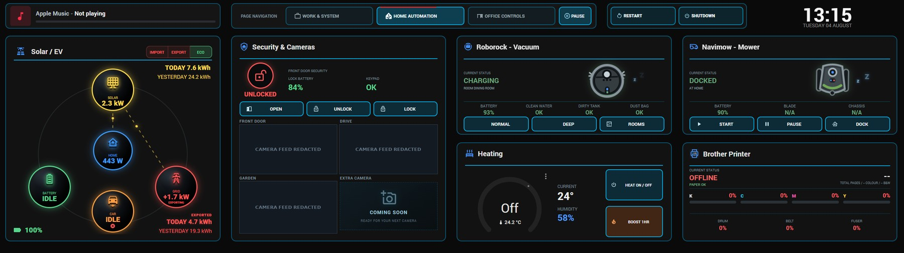
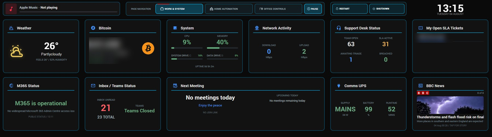
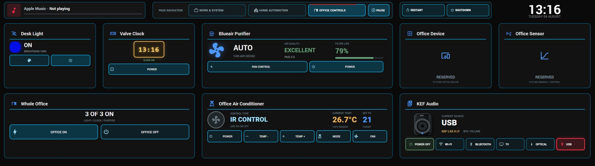
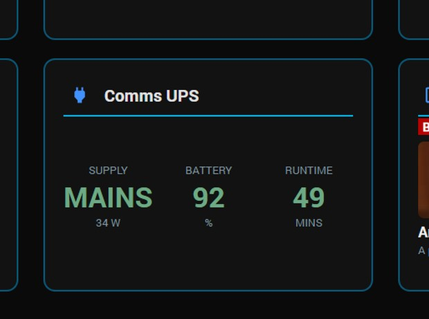
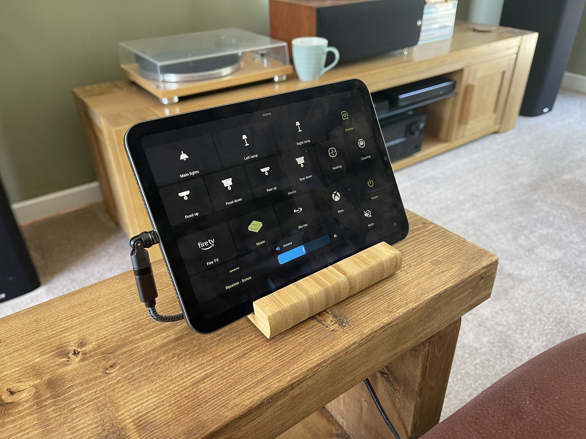
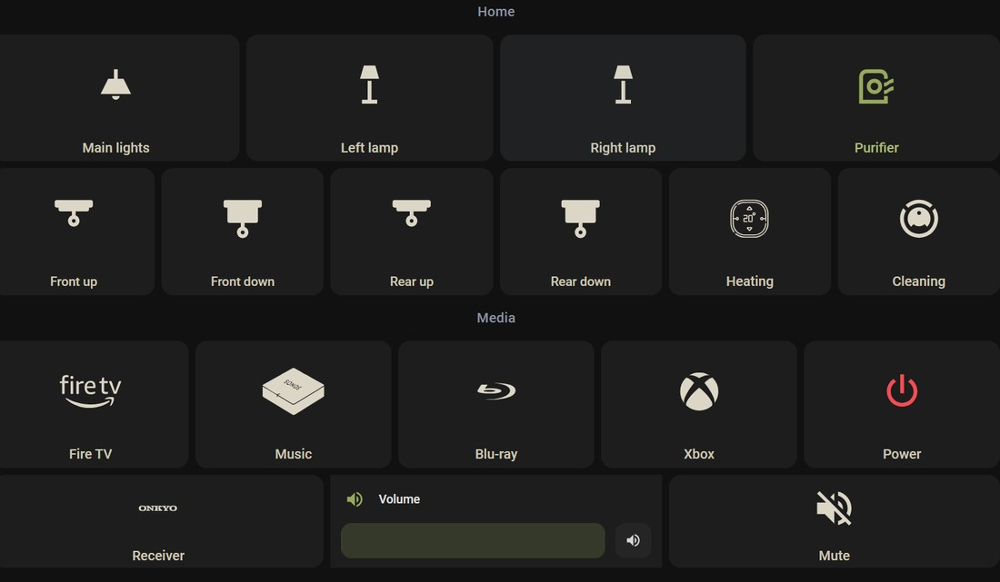
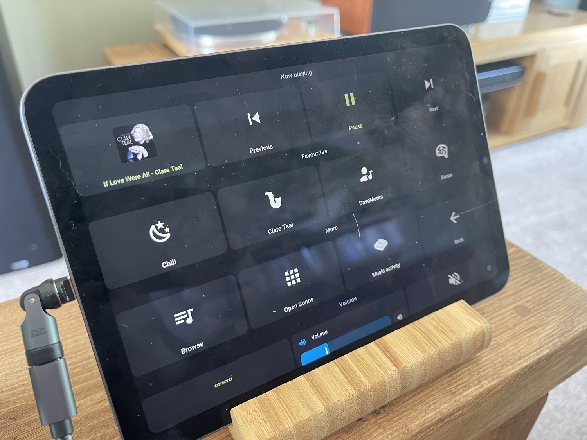
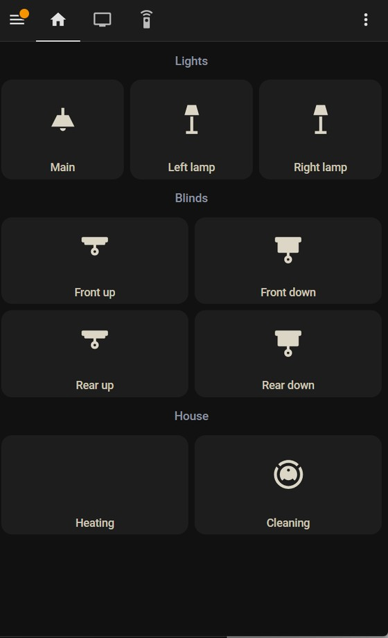
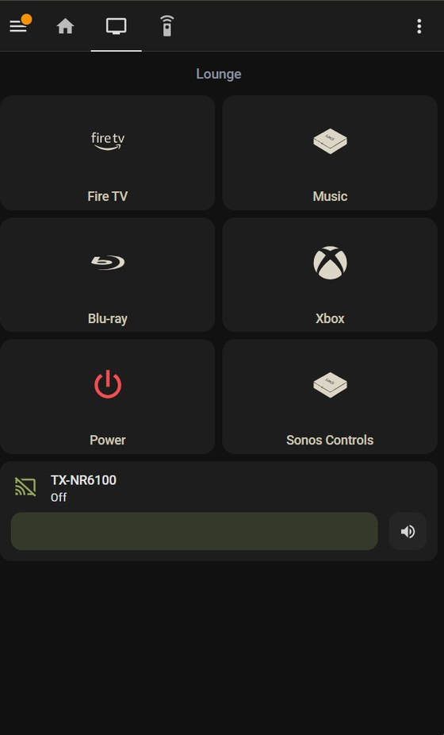
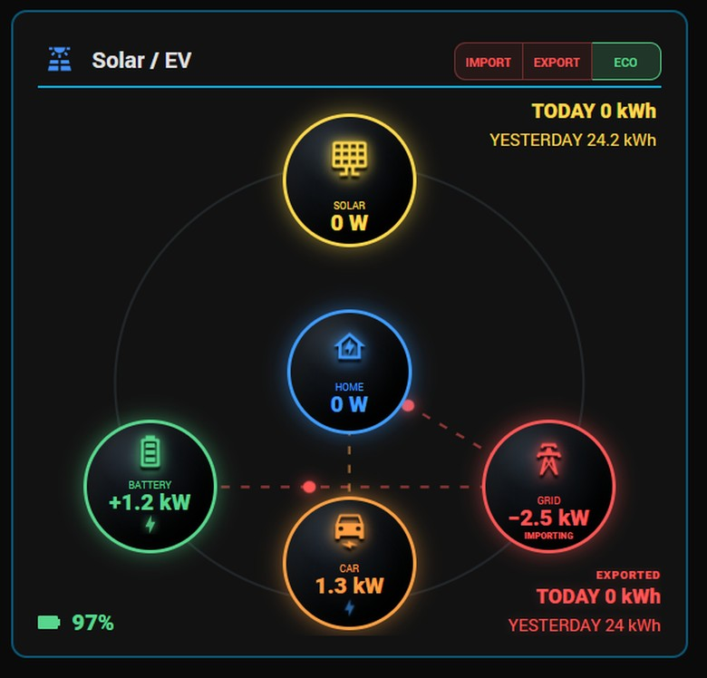

# A whole-house Home Assistant control system

**Three screens, one design language, and the twenty-odd things that went wrong**

A desk kiosk, a wall tablet and a phone dashboard driving lighting, blinds, heating, multi-room audio, a full AV stack, solar and battery storage, an EV charger, cameras, a door lock and a UPS.

> [!WARNING]
> ## Code and documentation aided by Claude and Cowork
>
> The dashboards, scripts, card templates and this document were produced with substantial help from **Claude** and **Cowork** (Anthropic), working interactively over several months.
>
> I should be upfront about *why*, because it shapes what this is. **I wanted to learn what AI can actually do** — not the demos, but what happens when you point it at a real, messy, long-running project with hardware that misbehaves. **I wanted to learn to code and genuinely understand it**, rather than paste things I couldn't explain. And most of all, **I wanted rid of the pile of separate apps** — one for the solar, one for the battery, one for the lock, one for the vacuum — and to build the beginnings of an actual smart home.
>
> **I'm not claiming full credit.** I'm a nerd using nerdy tools to make more nerdy things work. The architecture, hardware choices and design decisions are mine, and I tested every bit of it in my house — but a lot of the code was written by AI, and pretending otherwise would be daft.
>
> **And nothing here takes anything away from people who've built systems like this from their own knowledge.** Their write-ups are what got me started, and they did it the hard way.
>
> **What it means for you:** the patterns work — this runs here daily. Every fault described is one I actually hit. But this is not hand-written, peer-reviewed code. There's no test suite. **Test anything you copy.**

---

## Contents

1. [Why this exists](#1-why-this-exists)
2. [The system at a glance](#2-the-system-at-a-glance) — including the full kit list
3. [A design language](#3-a-design-language)
4. [Surface one: the desk kiosk](#4-surface-one-the-desk-kiosk)
5. [Surface two: the wall tablet](#5-surface-two-the-wall-tablet)
6. [Surface three: the phone](#6-surface-three-the-phone)
7. [The energy flow card](#7-the-energy-flow-card)
8. [Scripts that feel instant](#8-scripts-that-feel-instant)
9. [Watchdogs](#9-watchdogs)
10. [Styling inside shadow DOM](#10-styling-inside-shadow-dom)
11. [Moving to new hardware](#11-moving-to-new-hardware)
12. [Everything I would tell myself](#12-everything-i-would-tell-myself)
13. [The code](#13-the-code)
- [Appendix A: the kiosk host application](#appendix-a-the-kiosk-host-application)

---

## 1. Why this exists

There is no shortage of Home Assistant tutorials. What there is less of is a worked example of a **complete** system: several screens that share a visual language, a set of scripts that behave predictably, and an honest account of the things that broke along the way.

This is that account. It documents three dashboards and the code behind them, but the parts I'd most like you to read are the failures. Nearly every hour I lost was spent on a system that looked healthy while being subtly wrong: a lock reporting "locked" when it was open, a card telling me my house used no electricity, a doorbell that had silently gone deaf.

Those failures share a shape, and once you can recognise it you'll save yourself a great deal of time.

### What you'll find here

- **Patterns you can lift directly** — tile templates, activity scripts, a page-rotation controller, watchdog automations
- **Techniques that are hard to discover** — how to recolour Home Assistant's own sliders, how to animate a progress ring inside a card, why one obvious approach to both fails silently
- **Design reasoning** — why two colours beat eight, why a wall panel needs different rules from a phone
- **Debugging stories** — what stale data looks like, and how to tell "broken" from "quiet"

### What you won't find

Not a copy of my configuration. My entity IDs, source strings and sensor names are specific to my hardware, and pasting them into your system would achieve nothing. Everything in [`code/`](code/) is genericised, commented and written to be adapted.

Nor is it a beginner guide. It assumes you have Home Assistant running, know your way around YAML, and have installed something from HACS before.

> [!IMPORTANT]
> **The one prerequisite:** almost everything visual here uses [**custom:button-card**](https://github.com/custom-cards/button-card) from HACS. It's the single most useful frontend addition I've installed: any tile, any layout, any logic, driven by JavaScript templates. [**card-mod**](https://github.com/thomasloven/lovelace-card-mod) is the other one worth having, for when you need to style a native card rather than replace it.

---

## 2. The system at a glance

Three control surfaces, each with a different job. That distinction matters more than any individual card, because it determines what belongs where.

| Surface | Job |
|---|---|
| **Desk kiosk** | A widescreen panel on a mini PC, always on, viewed from a metre away while doing something else. Shows **status**: energy, work calendar, system health, news. Cycles pages on a timer. Rarely touched. |
| **Wall tablet** | A tablet on a stand in the lounge. Shows **the room I'm in**: lights, blinds, heating, the AV stack, music. Big tiles, tapped with a thumb while walking past. |
| **Phone** | Goes everywhere, so it can assume **nothing about location**. Same controls, smaller tiles, no default room, detail pages behind subviews so the top level stays short. |

### The kit, with tags

Named explicitly so you can tell at a glance whether any of this applies to you. If your brands differ, the patterns still hold — only the entity IDs change.

#### Energy

| Kit | How it's integrated |
|---|---|
| **GivEnergy** inverter + battery | Read and controlled over **local Modbus** via the GivTCP add-on, which publishes to MQTT. No cloud dependency — which turned out to matter when the manufacturer entered administration. |
| **GivEnergy** EV charger | Also via GivTCP. Its local API stalls roughly daily; see [chapter 9](#9-watchdogs). |
| **Octopus Energy** | HACS integration. Time-of-use tariff with a cheap overnight window, which the battery schedule is built around. |
| **Axle Energy** | HACS integration for grid flexibility events — the battery exports on demand during a paid event. |

#### Audio and video

| Kit | How it's integrated |
|---|---|
| **LG** OLED television | Native `webostv` integration, plus wake-on-LAN to power it on. HDMI-CEC deliberately disabled. |
| **Onkyo** TX-NR6100 amplifier | Native `onkyo` integration over eISCP. Its source string is what drives every activity tile. |
| **Sonos** Port and bar | Native integration. The Port is wired into the amplifier, so lounge music comes through the AV system; the bar is a separate zone. |
| **Amazon** Fire TV Stick | Android TV integration over ADB. Slow and unreliable enough that it's being replaced with an Apple TV. |
| **Xbox** Series S | Official `xbox` integration using Home Assistant Cloud account linking — **no Azure app registration needed**, contrary to a lot of older advice. |
| **Panasonic** Blu-ray | No network control at all, so a **SwitchBot IR blaster** provides power. One-way, so state is always unknown. |

#### Lighting, blinds and plugs

| Kit | How it's integrated |
|---|---|
| **Tuya** lights and plugs | Tuya cloud integration. Needs re-authenticating after a server migration. |
| **Govee** lamps | Govee integration for the two lounge floor lamps. |
| **Somfy** RTS blinds | Via an **Overkiz** gateway. One-way radio, so position is never reported — use explicit open and close, never toggle. |
| **TP-Link Tapo** | Plugs, plus an H100 hub with tap buttons. The hub uses sub-GHz radio, so range through walls is generous. |

#### Climate, cleaning and grounds

| Kit | How it's integrated |
|---|---|
| **Google Nest** thermostat | Native integration. Remember `hvac_action`, not state. |
| **BlueAir** 411i Max purifier | Native integration — fan, status LED, air quality, filter life. |
| **Roborock** Qrevo Edge | Native integration, with per-room cleaning scripts for normal and deep passes. |
| **Segway Navimow** | Robot mower, via HACS. |

#### Security

| Kit | How it's integrated |
|---|---|
| **Ring** doorbell and cameras | Native integration. The push listener dies silently — hence the watchdog in [chapter 9](#9-watchdogs). Being replaced by a wired system. |
| **Nuki** smart lock | Over **MQTT** straight to my own broker, far better than a cloud callback. See [chapter 11](#11-moving-to-new-hardware) for how a restore broke it. |
| **Reolink** NVR and cameras | Wired PoE, planned replacement for the cloud cameras. The integration supports adding the NVR directly and enumerates each channel. |

#### Infrastructure

| Kit | How it's integrated |
|---|---|
| **Home Assistant OS** | On a small x86 mini PC, wired. Previously a thin client — [chapter 11](#11-moving-to-new-hardware) covers the move. |
| **Eaton 3S 700** UPS | Monitored over **USB** using the NUT add-on plus the Network UPS Tools integration. No network card at this size; the RJ45 sockets on the back are surge pass-through, not management. |
| **Mosquitto** broker | Add-on. Note its logins may not survive a backup restore. |
| **HASS.Agent** | On the Windows desktop, giving shutdown and restart buttons on the dashboard. |
| A custom bridge | A small process on the desktop posting work data — calendar, mail counts, ticket counts, news — into Home Assistant as sensors over the REST API. |
| **Corsair XENEON Edge** | The widescreen kiosk panel, driven by a purpose-built WPF host application ([Appendix A](#appendix-a-the-kiosk-host-application)). |

#### Frontend add-ons (all HACS)

| Add-on | Why |
|---|---|
| **button-card** | Does nearly all the visual work here. Essential. |
| **card-mod** | For styling Home Assistant's own cards — see [chapter 10](#10-styling-inside-shadow-dom). |
| **kiosk-mode** | Hides the header on the tablet dashboard. |
| **custom-brand-icons** | Device logos — Fire TV, Sonos, Xbox, Onkyo — with the `phu:` prefix. |

### One principle above the others

**Prefer local control.** The battery is read over Modbus on my own network, not through the manufacturer's API. That looked like mild paranoia when I set it up. Then the manufacturer went into administration, and it became the reason my storage system still works.

The same reasoning applies throughout. A doorbell whose events arrive by cloud push has a listener that can die silently. A lock that publishes to your own MQTT broker does not. Where you have the choice, take the local one — it's usually faster too.

> [!CAUTION]
> **And a corollary: don't update firmware on hardware you can't replace.** My inverter manufacturer no longer exists, so a failed flash would mean buying a new inverter and paying an installer. The upside of an update is a minor bug fix; the downside is a very expensive paperweight. If there's an auto-update setting on kit like that, turn it off.

---

## 3. A design language

The single change that most improved these dashboards was **throwing away colour**.

An earlier version used amber for media, brown for heating, purple for cleaning, teal for blinds. Each choice was defensible and the result was a fruit machine. Worse, it was *slower to read*: with eight colours in play, none of them means anything.

### Two colours, one job each

| Colour | Meaning |
|---|---|
| Linen `#ddd6c8` | Off, closed, idle, at rest. The default state of everything. |
| Olive `#94a860` | On, open, active, running. Something is happening. |
| Red `#ff5656` | Reserved. Warnings, and the "everything off" button. Used sparingly enough that it still registers. |

Labels use slightly muted variants (`#cfc7b6` and `#a9bd76`) so the icon reads first and the text second. Backgrounds are a barely visible white wash — `rgba(255,255,255,0.05)` — on a dark theme, which gives tile edges without drawing borders.

From across a room you can now answer "is anything on?" without reading a single word.

### Three sizes, chosen by distance

| Surface | Sizing |
|---|---|
| Wall tablet | 150px tiles, 54px icons, 16px labels |
| Phone | 126px tiles, 44px icons, 14px labels |
| Secondary (favourites, pickers) | 104px tiles, 34px icons, 13px labels |

### The rule I keep coming back to

**A tile must never lie.** That sounds obvious, and it's where almost every fault in this document ends up. A tile showing the wrong state is worse than one showing nothing, because you act on it. My lock reported "locked" for a full morning while the door was open, and my house reported using zero electricity while the kettle was on.

In practice: **colour tiles from the thing that physically knows the answer**, not from a value you stored earlier. [Chapter 5](#5-surface-two-the-wall-tablet) shows what that looks like.

---

## 4. Surface one: the desk kiosk

A widescreen panel that cycles through three pages on a one-minute timer: work and system status, home automation, and room controls. Glanceable furniture rather than something I interact with.



*The home automation page in full. Energy flow on the left, then security, the vacuum and mower, heating and the printer. Camera thumbnails are redacted here; on the panel they're live. The navigation pills along the top — the active one carries the countdown ring.*



*Weather, system load, network throughput, support-desk figures, mail and calendar, UPS status and news. Financial values and a ticket reference are redacted.*



*Desk lighting, a clock plug, air purifier, air conditioning by infrared, and speaker input selection. Two tiles are deliberately reserved for future kit, which keeps the grid balanced.*

### Layout on a very wide screen

Ordinary card layouts don't suit a 2560×720 panel: masonry wants columns, sections want to stack. What worked was a **single full-screen button-card** with a CSS grid of named areas, each area holding a nested card as a custom field.

```yaml
custom_fields:
  clock:    { card: { type: custom:button-card, ... } }
  solar:    { card: { type: custom:button-card, ... } }
  network:  { card: { type: custom:button-card, ... } }
styles:
  grid:
    - grid-template-areas: "'clock solar network' 'diary solar ups'"
    - grid-template-columns: 1fr 1.4fr 1fr
```

That gives absolute control of a fixed-size display. It has one serious drawback: **one JavaScript error in any template blanks the entire screen.** Always evaluate a template against live state before saving ([chapter 10](#10-styling-inside-shadow-dom) shows how). I've blanked that panel more than once, and fixing it blind is no fun.



*A widget in the house style: three figures with grey labels, colour-coded by threshold. The supply figure turns red and the icon changes to a battery the moment mains power goes.*

The panel is driven by a small purpose-built Windows application rather than a browser in kiosk mode — see [Appendix A](#appendix-a-the-kiosk-host-application).

### Automatic page rotation

Storage-mode dashboards give you nowhere to put a script, so the only place JavaScript can live is inside a button-card template. My first attempt ran the whole rotation engine as a side effect of a card's `name:` template, ticking on a one-second update timer and returning "PAUSE" as the button label.

It was clever, and it failed in the worst possible way: on one particular page the card stopped re-rendering, and because the engine only existed *during* a render, rotation simply stopped. Everything still looked fine. The countdown ticked into negative numbers with nothing listening.

> [!TIP]
> **The fix, and the general lesson:** install a **single persistent loop** once per page load that reads state directly from the `hass` object, rather than depending on any card rendering. A render stall can then no longer stop it.
>
> More broadly: **if a mechanism only runs as a side effect of something else, it will eventually stop running and you won't be told.** Full code in [`code/06-page-rotation-controller.js`](code/06-page-rotation-controller.js).

### A countdown you can see

Auto-rotation is pleasant until you're halfway through reading something and the page changes. The fix was to make the remaining time visible: the active navigation button's existing blue border fills red, clockwise, completing exactly as the page flips.

Getting that working taught me two things about animating inside a card, both in [chapter 10](#10-styling-inside-shadow-dom).

---

## 5. Surface two: the wall tablet



*Lights and lamps, blind controls, heating and cleaning, then the media row with device logos, and a volume slider along the bottom.*



*Olive means active — here the purifier is running and everything else is at rest.*

### Panel, not masonry

My tiles kept coming out at about 117 pixels wide instead of the 150 I'd specified, wasting a third of the screen. The cause: **masonry views cap column width**. On a tablet, use `type: panel` with a vertical-stack inside, and you get the full width.

On a phone, masonry is fine — the screen is narrower than the cap anyway — so the two dashboards differ here deliberately.

### Templates, not repetition

Every tile derives from two templates: one for stateful things, one for section headings. Changing a corner radius then means editing one place rather than forty. Full definitions in [`code/04-tile-design-system.yaml`](code/04-tile-design-system.yaml).

> [!NOTE]
> **If you have a thermostat:** a climate entity's **state is its mode**, not whether it's currently calling for heat. Set to "heat", it reads "on" all summer. The attribute you actually want is `hvac_action`, which tells you whether the boiler is running.

### Activity tiles: the idea I'd most like you to steal

Five tiles — streaming, music, disc, console, everything off. Tapping one sets up the whole room. The interesting part is how they know which is active.

**The wrong way**, which I built first: store the current activity in an `input_select`, set it from each script, colour the tiles from that. **It lies.** Mine only ever held "Fire TV" or "Music", so when I added a console and a disc player the music tile stayed lit while I was gaming. It also survives you turning things off by hand, so the dashboard cheerfully reports an activity that ended hours ago.

**The right way:** colour the tiles from the **amplifier's actual source**. It's the one device that cannot be wrong, because it's physically switching the signal. Only one tile can be lit, and it's correct by construction.

```javascript
var e   = states['media_player.lounge_receiver'];
var src = (e && e.attributes) ? (e.attributes.source || '') : '';
var on  = (e && e.state !== 'off' && e.state !== 'unavailable'
             && /STRM/i.test(src));
return on ? '#94a860' : '#ddd6c8';
```

Amplifier source strings are peculiar — mine include things like `VIDEO3 ··· GAME/TV ··· GAME`, with three middle-dot characters. Match a distinctive **fragment** with a regular expression rather than the whole string. Read your own list first:

```jinja
{{ state_attr('media_player.your_receiver','source_list') }}
```



*Album art pulled from the speaker, transport controls, favourites, and an olive volume slider — recolouring which took an embarrassing amount of investigation. See [chapter 10](#10-styling-inside-shadow-dom).*

### Mounting, briefly

- A **right-angle magnetic USB-C** lead, routed behind the stand, keeps the cable invisible and lets you lift the tablet off. Check the adapter supports enough power — some are data-only and will slowly lose the battle on an always-on display.
- **Tap to wake** plus a ten-minute auto-lock beats fighting the operating system over brightness. Home Assistant **cannot set screen brightness on iOS** at all; on Android it can. For scheduled dimming on an iPad, use Apple's Shortcuts app.
- Consider turning the passcode **off** if the tablet lives in a family room and only ever shows the dashboard. With Guided Access it then behaves like a fitted wall panel.

---

## 6. Surface three: the phone

Not a shrunken tablet. A different design brief: it goes everywhere, so it can assume nothing about where you're standing.

<p align="center">
  
  
</p>

*Left: home — lights three across, blinds two-by-two, then heating and cleaning. Right: media — four activity tiles, Power, and a Sonos Controls tile that opens the music subview.*

### What changes

- **Three top-level views only** — Home, Media, Remote. A tab bar with seven entries is unusable on a phone.
- **Detail pages become subviews.** `subview: true` keeps a page out of the tab bar and gives it a proper back arrow.
- **No default room.** The tablet can assume the lounge; the phone offers every room equally.
- **Fewer decorative tiles.** The air purifier lives on eco mode permanently and never needed a tile.

### An audio zone picker

With speakers in two rooms you need three behaviours: play here, play there, or play in both. A favourites row under each speaker duplicates every tile and still doesn't give you "both".

The answer was to copy the manufacturer's own app: **tick the rooms, then pick what to play.** Two helpers hold the selection; one script does the work, grouping the speakers automatically when both are ticked and ungrouping when only one is. Code in [`code/02-battery-and-audio-scripts.yaml`](code/02-battery-and-audio-scripts.yaml).

> [!WARNING]
> **A user-experience lesson I walked straight into.** I built the zone ticks, tested that the helpers toggled, and declared it working. Then I tapped a favourite and nothing happened — because no room was ticked, and the script correctly did nothing.
>
> **A mode selector that produces no visible change feels broken.** The fix was a templated heading reading "Favourites — both rooms" or "Favourites — tick a room above first". **Hidden state must be visible somewhere.**

### Two smaller touches that earn their keep

- **A loading spinner** on each activity tile while its script runs. Without it people press twice.
- **A now-playing strip** that appears on the Media page only when music is the active source, using a conditional card. So the common case needs no navigation, and the page stays short otherwise.

### And one thing I got wrong

I put "open the music page" on the **hold** action of the Music tile, copying the tablet. A deliberate press tips over Home Assistant's roughly 500ms hold threshold, so tapping Music *navigated* instead of playing music. I caught myself out with my own dashboard, twice.

**If an action matters, give it a visible tile.** Hold actions are for extras.

---

## 7. The energy flow card

Five circles on a ring — solar, house, battery, grid, car — with animated lines showing where power is flowing. The card I look at most, and the one that's caused the most trouble, because it does **arithmetic on sensor readings**.

<p align="center">
  
</p>

*Reading correctly at midnight during the cheap-rate window: no solar, importing from the grid, battery charging, car idle but plugged in. Getting that last figure to tell the truth took three attempts.*

### Design details worth copying

- **Thresholds, not gradients.** Battery green above 80%, amber 20–80, red below. Faster to read than a continuous scale.
- **A deadband on discharge.** A battery reports 15–20W of self-consumption constantly; without a 300W floor the discharge animation runs all night. The deadband relaxes to 20W during a deliberate forced export, when you *do* want to see small flows.
- **Hide the trickle at 100%.** A full battery accepting 60W of surplus solar is noise. Above 99% the node reads IDLE and no flow line is drawn.

### The trap: subtracting the car from the house

The card worked out the house figure as `load - car`, reasoning that the inverter's load reading includes everything including the charger. Sound logic. It failed three times.

**Once** when the charger stalled and reported a phantom 7.2kW session into a car that was already full, with its internal clock seven hours adrift. The subtraction produced a negative number, clamped to zero, and my house appeared to use no electricity.

**Once** when I briefly had two Home Assistant instances polling the same inverter during a migration. Modbus doesn't tolerate that; values land in the wrong registers.

**And once for the real reason**, which took longest to see: my charger reports `charging_state: "Charging"` whenever **a cable is attached**, whether or not any current flows. The card trusted that word, inferred a session, derived a plausible figure, and subtracted it. It only misbehaved during the overnight battery charge, because that's when there was a large grid import to misattribute — and I was asleep for it every night for weeks.

> [!TIP]
> **The fix, in one line: trust measured power, never a state word.**
>
> ```javascript
> var carPower = parseFloat((states['sensor.ev_charger_power']||{}).state) || 0;
> home = Math.max(0, load - carPower);
> carValue = (carPower > 20) ? fmt(carPower) : 'IDLE';
> ```
>
> Zero watts means nothing is charging. No inference, no estimation, nothing to go stale. The same principle fixed the car icon: pulsing bolt when power flows, static plug when merely connected, red cross when unplugged.

### A test worth running on your own sensors

Before building anything that does arithmetic, check your understanding is correct. Energy must balance:

```
solar + grid_import + battery_discharge
    ≈
house_load + battery_charge + grid_export
```

If that doesn't add up to within a few per cent, something is misread — a sign convention, a duplicated figure, a sensor that means something other than you think.

Fuller notes in [`code/07-energy-flow-card.md`](code/07-energy-flow-card.md).

---

## 8. Scripts that feel instant

Pressing "watch television" has to wake the TV, power the amplifier, switch its input, wake the streaming box and stop whatever was playing. Written in the obvious order that took **twenty to forty seconds**, because you end up waiting for the television before you even start on the amplifier.

### Parallel branches

Restructured as parallel branches — one per device — the whole thing takes as long as the **slowest single device**. Same result, a third of the wait, and it feels like a different system.

```yaml
mode: restart
sequence:
  - parallel:
      - sequence:          # television: wake, wait, select input
      - sequence:          # amplifier: power, wait, select source
      - sequence:          # source device: wake, send HOME
      - sequence:          # pause music if it is playing
```

| Setting | Why |
|---|---|
| `mode: restart` | Tapping twice restarts cleanly instead of queueing two runs. |
| `continue_on_error` | One unreachable device must not abandon the whole script. |
| `wait_template` | Wait for the device to be *ready* rather than guessing a delay. With `continue_on_timeout` so a slow TV can't block the rest. |
| Guard conditions | Only wake the console if it's actually off. Tapping the tile mid-game should do nothing. |

Full scripts in [`code/01-activity-scripts.yaml`](code/01-activity-scripts.yaml).

### A note on waking things

Wake-on-LAN works for televisions. It **does not wake an Xbox** — that uses Microsoft's own protocol, and I wasted a while on magic packets before discovering it. The official integration exposes a remote entity with a `WakeUp` command, which works reliably. The console must be in **sleep** mode rather than energy-saving, and expect roughly a minute's lag before the state updates, because it reports via the vendor's cloud.

For devices with no network control at all, a smart **infrared blaster** gives you power control for very little money. It's one-way, so the entity state reads "unknown" forever.

### The discipline of turning off

My "everything off" script turned off the television, the streaming box and the amplifier. I was pleased with it. **It did not pause the speaker.**

One night I pressed it at 01:33 with music playing. The music kept streaming silently, because the amplifier was off. At 02:59 the amplifier powered itself on — an unrelated quirk of that unit — and the house filled with Bruce Springsteen. I woke at 04:44 wondering what on earth was happening.

> [!CAUTION]
> **Pause audio first, before anything else**, and pause it from *every* activity script rather than only the off button. If something can play silently, one day it will play loudly at the worst possible moment. There's also a belt-and-braces automation in [`code/03-automations-and-watchdogs.yaml`](code/03-automations-and-watchdogs.yaml) that stops overnight playback when the amplifier is off.

### Order matters more than you'd think

The music script turns the television off, because music through a speaker needs no screen. That failed intermittently until I understood why: **if the games console was still awake and pushing HDMI, the TV either ignored the standby command or woke straight back up.**

The working order is: sleep the console, **wait two seconds**, then turn off the television. Let the HDMI signal go quiet before asking the display to sleep.

---

## 9. Watchdogs

Most automation is about making things happen. The automations I value most do the opposite: they notice when something has **stopped** happening. That's much harder, because a broken integration looks identical to a quiet house.

> [!IMPORTANT]
> ### The signature to look for: alive but silent
>
> **Polled data keeps updating while pushed data stops.** The integration reports as loaded, the device works in its own app, nothing appears in any log — and yet the events you care about never arrive.
>
> **Look for one sensor moving while a related one is frozen.** That mismatch is the tell.

### Three real examples

| Device | What happened |
|---|---|
| **Doorbell** | The cloud push listener died. Its activity sensor kept updating while the ding and motion events sat frozen from the previous day, so the doorbell simply never rang in Home Assistant. Nothing in any log. The watchdog fires only when activity is *recent* **but** events are *stale* — that double condition is what stops it firing during a quiet week away. |
| **EV charger** | Its local API stops responding roughly once a day while the cloud connection stays up, so the phone app looks perfectly fine. Detected the same way: charger sensors frozen while the inverter keeps reporting. |
| **UPS** | Moving the unit disturbed the USB cable. The integration served its last known values indefinitely — zero watts, a 78-minute runtime — which looked like real data. The give-away was that every reading shared an identical timestamp an hour old. |

### The most useful habit in this document

**Check timestamps, not values.** When something looks wrong, the first question is not "what does this sensor say" but "when did it last change". Half the faults here announced themselves the moment I looked at `last_changed`.

```jinja
{{ states.sensor.my_sensor.last_changed }}
{{ (as_timestamp(now())
    - as_timestamp(states.sensor.my_sensor.last_changed, 0)) / 60 }} minutes ago
```

### A caution about reloading automatically

A watchdog that reloads an integration is a blunt instrument. Give it a wide margin — mine waits twelve hours — and **have it notify you when it acts**, so a recurring fault doesn't stay invisible behind a self-healing loop. A watchdog that silently papers over a daily failure is worse than none, because you never find the cause.

---

## 10. Styling inside shadow DOM

Two problems took longer than anything else in this project, and both come down to the same cause: Home Assistant's cards live inside **shadow DOM**, and some CSS features don't cross that boundary. Both fail **silently**, which is what makes them expensive.

### Problem one: recolouring a native slider

I wanted the volume slider on a tile card to be olive instead of Home Assistant's blue. The obvious approach did nothing:

```yaml
card_mod:
  style: |
    ha-card { --control-slider-color: #94a860 !important; }
```

Tracing the variable up the element tree showed it inheriting correctly all the way down — and then the slider element **overriding it**, because it derives its colour from `--tile-color`, which Home Assistant sets **inline on the card** from the entity's *state* colour. That also explained why it looked blue when the amplifier was on and grey when off: I wasn't fighting a theme, I was fighting the entity state.

```yaml
type: tile
entity: media_player.lounge_receiver
features:
  - type: media-player-volume-slider
card_mod:
  style: |
    ha-card {
      height: 110px !important;
      background: rgba(255,255,255,0.05) !important;
      border: 1px solid transparent !important;
      box-shadow: none !important;
      --tile-color: #94a860 !important;          /* the one that matters */
      --feature-color: #94a860 !important;
      --control-slider-color: #94a860 !important;
      --control-slider-background: #ddd6c8 !important;
      --control-slider-background-opacity: 0.18 !important;
    }
```

Style at the `ha-card` level **only**. My attempts to reach deeper collapsed the card and displaced its neighbours. Twice.

### Problem two: animating a progress ring

For the rotation countdown I reached for the standard modern technique: a conic gradient masked to the border, animated through a registered custom property. The pseudo-element appeared; the gradient and animation did nothing at all.

> [!WARNING]
> **Why it failed:** `@property` is **document-scoped**. Registering it inside a card's shadow root is silently ignored, so the custom property was invalid, which made the whole `conic-gradient` invalid, which killed the background — and with nothing to animate, the animation never ran either. **No error, no warning, nothing in the console.**

The answer is **SVG stroke animation**, which needs no custom properties and works happily inside shadow DOM:

```javascript
'<rect x="1" y="1" rx="9" fill="none" stroke="#ff2f2f" stroke-width="3"'
+ ' pathLength="100" stroke-dasharray="100" stroke-dashoffset="100"'
+ ' style="animation:dmsw ' + total + 'ms linear forwards;'
+ ' animation-delay:-' + elapsed + 'ms"/>'
```

Three details, each of which mattered:

- **`pathLength="100"`** normalises the path, so the dash values work at any element size. No perimeter arithmetic.
- **Position the overlay at `inset: -2px`.** An absolutely positioned child sits inside the *padding* box, so `inset: 0` draws the line inboard of the border — it reads as a second line rather than the border filling up.
- **A negative `animation-delay`.** The card re-renders periodically, and every re-render **restarts a CSS animation from zero**. The symptom was a line that crept forward, snapped back, crept slightly further, snapped back. A fixed duration with a negative delay equal to elapsed time makes every re-render land exactly where it should.

### What works and what doesn't, inside a card's shadow root

| Technique | Works? |
|---|---|
| CSS custom properties inheriting *in* | Yes |
| `@keyframes` | Yes |
| SVG `stroke-dashoffset` animation | Yes |
| Pseudo-elements via `::after` | Yes |
| `@property` registration | **No — document-scoped** |
| Reaching *into* a nested card's shadow root | Effectively no |

### Always pre-flight a template

One error in one template can blank an entire view. Evaluate against live state **before** writing the config:

```javascript
const inner = template.replace(/^\s*\[\[\[/,'').replace(/\]\]\]\s*$/,'');
const result = new Function('states','entity','user','hass', inner)(
    hass.states, null, hass.user, hass);
// only save if result is a non-empty string
```

This caught a real error — a variable I was reassigning turned out to sit inside a `const` declaration list. Had I saved it, the entire energy card would have gone blank.

Fuller write-up in [`code/05-styling-inside-shadow-dom.md`](code/05-styling-inside-shadow-dom.md).

---

## 11. Moving to new hardware

The server outgrew its original home — a thin client down to 3.4GB free, with backups being deleted to make room. Moving to a small refurbished desktop took an evening and went mostly smoothly. The parts that didn't are the useful bit.

### The procedure

| Step | Notes |
|---|---|
| **1. Full backup** | Emphasis on **full**. Mine turned out to be a *partial* and I'd deleted the older ones for space — which would have left me restoring without add-ons. Check the type before you rely on it. |
| **2. Match install type** | Home Assistant OS to Home Assistant OS. Same architecture means a like-for-like restore with nothing to convert. |
| **3. Write the image** | Boot a Linux live USB and write the OS image to the internal disk. **Check device names twice** — the wrong one destroys whatever is on it. Secure Boot off, UEFI on. |
| **4. Restore** | At onboarding choose **restore from backup** rather than creating an account. |
| **5. Take the address** | Only after the old machine is off. Everything points at that IP. |

> [!CAUTION]
> **Don't let both run for long.** While both instances are live they'll both poll your devices. My inverter is read over Modbus, which does not tolerate two pollers — values landed in the wrong registers and my energy card produced nonsense.

### The four things that broke

All four looked healthy from the outside, which is the theme of this entire document.

| What | What actually happened |
|---|---|
| **MQTT lock** | Reported "locked" all morning while the door was open. Two causes stacked: the broker add-on's **login didn't survive the restore**, so the lock couldn't authenticate — and the restore brought over **1,013 retained MQTT messages**, so Home Assistant was displaying a ghost of the old state. Nothing appeared in the broker log at all, not even a rejected connection, which sent me hunting for network problems that didn't exist. |
| **UPS** | The NUT integration reported `DATA-STALE`. Reloading the *integration* did nothing: the **add-on** needed restarting, because its USB driver had lost the device when I moved the unit and doesn't re-enumerate on its own. |
| **Speakers** | Reported state correctly but wouldn't accept commands, because the integration held stale connections from before the move. A reload fixed it in seconds, once I stopped assuming the fault was elsewhere. |
| **Cloud integrations** | The lighting integration needed re-authenticating and the doorbell asked for confirmation — both normal when a token moves to new hardware. |

### A checklist for afterwards

- **Add-on logins and credentials** — check them explicitly rather than assuming they came across
- **Retained MQTT messages** — anything MQTT-based may show convincing stale data until the device reconnects and publishes afresh
- **USB devices** — restart the owning **add-on**, not just the integration
- **Anything that registered a callback with your IP** — doorbells, locks, bridges
- **Your phone app** — mine still pointed at the temporary address for hours, showing cached values that contradicted the server

### And one final trap, entirely my own

Midway through, my diagnostic tools began reporting hour-old values and hanging on every request. I concluded the new server was struggling and spent a good while investigating a machine that was perfectly healthy.

The actual cause was a **stale browser session**. A fresh tab answered in eight milliseconds. **If your tooling insists that working things are broken, suspect the tooling.**

---

## 12. Everything I would tell myself

In rough order of how much time each would have saved me.

### On trusting your data

- **Check timestamps before values.** "When did this last change" finds more faults than "what does this say".
- **Stale data looks exactly like real data.** Retained MQTT messages, frozen integrations and cached app views all present confident, plausible, wrong numbers.
- **A state word is not a measurement.** "Charging" meant "cable attached" on my hardware.
- **Derive from the thing that physically knows.** The amplifier cannot be wrong about its own input.
- **Make the energy balance.** If inputs don't equal outputs, you've misunderstood a sensor.

### On writing frontend code

- **Pre-flight every template.** One error can blank a whole view.
- **`@property` does not work inside shadow DOM.** Document-scoped, fails silently. Use SVG stroke animation.
- **Sliders take their colour from `--tile-color`**, set inline from entity state. Override that, with `!important`.
- **Re-renders restart CSS animations.** Fixed duration plus a negative delay.
- **Keyframes must travel with the element that uses them.** Define them unconditionally.
- **Don't hide important actions behind hold.** A deliberate press crosses the threshold.

### On making things reliable

- **Never rely on a mechanism that only runs as a side effect.**
- **Pause audio first.** Anything that can play silently will eventually play loudly at 3am.
- **Guard every wake and sleep.** Only wake what's off; only sleep what's on.
- **Prefer local control.** Faster, and it survives the vendor going out of business.
- **Don't update firmware you can't replace.**
- **Put the router and the modem on the UPS**, not just the server — otherwise your power-cut notification has nowhere to go.

### On design

- **Two colours are enough.** Eight is a fruit machine, and slower to read.
- **Hidden state must be visible.**
- **Different screens need different briefs.** A phone is not a small tablet.
- **Show progress.** A spinner stops people pressing twice.
- **Let the numbers be specific.** "LOW 19GB" beats "LOW".

### On the process

- **Use the logbook.** It annotates state changes with what caused them, which settled the 3am music mystery in one query — the amplifier had switched itself on with no involvement from Home Assistant at all.
- **Write things down as you go.** The hour I lost to the lock was mostly not knowing how it had originally been configured.
- **Live with it before extending it.** Every change I'm pleased with came from an actual irritation. The ones I invented at a keyboard mostly got reverted.

---

## 13. The code

Everything is in [`code/`](code/), genericised and commented. Entity IDs are placeholders.

| File | Contents |
|---|---|
| [`01-activity-scripts.yaml`](code/01-activity-scripts.yaml) | The parallel-branch AV activity pattern: streaming, music, console, disc and everything-off, with guards, waits and the audio-pause discipline. |
| [`02-battery-and-audio-scripts.yaml`](code/02-battery-and-audio-scripts.yaml) | Battery mode toggles for a solar system, and the multi-room audio zone picker with automatic grouping. |
| [`03-automations-and-watchdogs.yaml`](code/03-automations-and-watchdogs.yaml) | UPS power-cut alerts, the doorbell event watchdog, an EV charger stall detector, a low-storage warning and the overnight silent-audio guard. |
| [`04-tile-design-system.yaml`](code/04-tile-design-system.yaml) | The button-card templates, activity-tile logic, dynamic headings, warning badges, and layout notes. |
| [`05-styling-inside-shadow-dom.md`](code/05-styling-inside-shadow-dom.md) | The slider colour fix and the progress-ring technique, with the diagnostic output behind each conclusion. |
| [`06-page-rotation-controller.js`](code/06-page-rotation-controller.js) | The persistent rotation controller and countdown ring, with notes on using it as a watchdog over an existing engine. |
| [`07-energy-flow-card.md`](code/07-energy-flow-card.md) | Flow card structure, thresholds and deadbands, the EV subtraction trap, and a plausibility check for derived figures. |
| [`08-kiosk-host-app.md`](code/08-kiosk-host-app.md) | The Windows kiosk host: why build one, how it's structured, and simpler alternatives. |

### If you use any of it

Take it, change it, publish your own version. It's all here because other people's write-ups saved me time, and this is the return leg.

**The one thing I'd ask:** if one of these patterns fails on your hardware, say so — open an issue. Half the value here is the faults, and the only reason I could document them is that they happened in a real house with real kit that didn't behave as documented.

---

## Appendix A: the kiosk host application

The widescreen panel is driven by a small purpose-built Windows application. **The full source is in [`app/XEON-DashboardV3/`](app/XEON-DashboardV3/).** Take it, rename it, do as you like.

> [!WARNING]
> **The same disclaimer applies, doubly.** This application was written almost entirely by AI, working to my specification. It runs here 24 hours a day and has done for months, but it hasn't been reviewed by anyone else, has no test suite, and is **not code-signed** — so Windows SmartScreen will warn about it.
>
> **Read it before you run it, and build it yourself rather than trusting a binary from a stranger.**

### Why build one at all?

It began as PowerShell launching Edge in kiosk mode, which worked until it didn't: an update banner, a crash-restore bar, a lost focus, a stray keypress opening a tab.

- **It survives.** No browser chrome, no update prompts, no way to navigate away.
- **It knows which monitor it belongs on.** Display indices shuffle when you plug something in; it matches on the monitor's *name* and reasserts itself if the layout changes.
- **It starts with Windows and hides.** No console window, a tray icon for the rare occasion you need it.
- **It reconnects.** If Home Assistant restarts or the network blips, it retries rather than sitting on an error page.

### The stack

| Choice | Why |
|---|---|
| **WPF on .NET 8** | Chosen over WinUI 3 deliberately. For a 24/7 borderless single-monitor kiosk that must publish as a self-contained executable needing no admin rights, WPF meets every requirement with less friction. MVVM, dependency injection and Serilog throughout. |
| **WebView2** | The Chromium engine already present on Windows 10 (2004+) and 11. The app detects it and can provision it if missing. |
| **Self-contained publish** | A single ~70MB executable with the runtime bundled, so nobody has to install .NET. An Inno Setup script wraps it with shortcuts, no admin required. |

### Building it

```powershell
dotnet restore
dotnet build -c Debug
dotnet run --project src/XeonDashboard/XeonDashboard.csproj
```

Copy `Docs/settings.sample.json` to `settings.json`:

```json
{
  "DashboardUrl": "http://homeassistant.local:8123/lovelace/0?kiosk",
  "MonitorName": "XENEON EDGE",
  "LaunchDelaySeconds": 10,
  "ReconnectIntervalSeconds": 5,
  "HideMouse": false,
  "AlwaysOnTop": false,
  "StartWithWindows": false,
  "ExitSilentlyIfMonitorMissing": false
}
```

Set `MonitorName` to an empty string to fall back to the primary display — otherwise it looks for a monitor literally named XENEON EDGE and you'll wonder why nothing appears.

### The decisions that mattered

- **Native resolution, no scaling.** The app is a browser viewport; it cannot re-flow your dashboard. If the layout looks wrong, fix it in Home Assistant. Trying to solve layout in the host is a trap.
- **Find the monitor by name, not index.** With a fallback, or nobody else can run your build.
- **Single-instance lock.** Two copies fighting over one fullscreen window is a miserable bug.
- **Keep the tray icon.** The temptation is to make an appliance completely inescapable. Resist it.
- **The host stays dumb.** It navigates once and stays there. All page cycling happens inside Home Assistant, so the dashboard behaves identically in any browser.

### Things worth knowing before you run it

- **SmartScreen will warn** about an unsigned executable.
- **The kiosk is a separate browser session** from your desktop. When the panel looks stuck but your browser is fine, reload the panel. I lost an hour to this.
- **Signed camera URLs expire.** A page held open for weeks will retry with stale tokens after a server restart, logging warnings that look alarming and are harmless.
- **Long-lived pages accumulate problems.** A nightly refresh costs nothing.
- **The publish folder holds a browser profile** containing your Home Assistant session. Never share it — only source. That's why this repo excludes it.

### If you'd rather not run a Windows app

Entirely reasonable. A **Raspberry Pi with Chromium in kiosk mode** and a systemd unit is the cheapest well-trodden route. An **old tablet** running the companion app takes no effort and gives you touch. **Fully Kiosk Browser** on Android is genuinely excellent, with motion wake and remote admin built in.

I wrote a host because the panel is a Windows machine that also does other things, and I wanted it to behave like fitted furniture. If your display is dedicated hardware, one of the above will get you there faster.

---

*Built and broken and rebuilt over several months. Every fault described here is one I actually had.*
